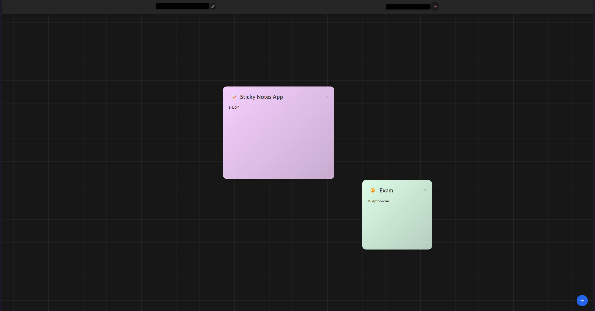

# Sticky Notes

A modern, interactive sticky notes application that helps you organize your thoughts, tasks, and ideas in a beautiful and intuitive interface. Create, arrange, and manage your digital sticky notes with ease.

## Key Features

- **Interactive Workspace**: Create and manage multiple sticky notes on a flexible canvas
- **Drag & Drop**: Freely arrange your notes anywhere on the workspace
- **Resizable Notes**: Adjust note sizes to fit your content perfectly
- **Rich Text Support**: Format your notes with basic text styling
- **Color Customization**: Personalize notes with different colors for better organization
- **Secure Authentication**: User authentication powered by Clerk
- **Private Notes**: Each user has their own private workspace
- **Auto-Save**: Your notes are automatically saved to the database
- **Responsive Design**: Works seamlessly on desktop and tablet devices
- **Real-time Updates**: Changes sync instantly across all open tabs

## Screenshots

### Main Dashboard

*Organize your thoughts with a clean, intuitive interface*

## Tech Stack

- Frontend: React, Vite, Tailwind CSS, Framer Motion
- Backend: Node.js, Express, MongoDB
- Authentication: Clerk
- Real-time Updates: WebSocket

## Quick Start

1. Clone and install:
```bash
git clone [repository-url]
npm install
```

2. Set up environment:
```bash
# Create .env file with your MongoDB and Clerk credentials
MONGODB_URI=your_mongodb_uri
PORT=5000
CLERK_PUBLISHABLE_KEY=your_clerk_publishable_key
CLERK_SECRET_KEY=your_clerk_secret_key
```

3. Run the app:
```bash
npm run dev     # Frontend
npm run server  # Backend
```

Visit `http://localhost:5173` to start using the app!

## License

This project is licensed under the MIT License.

